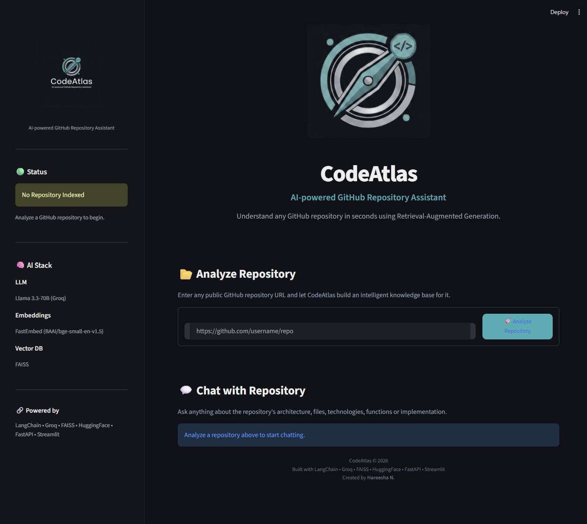
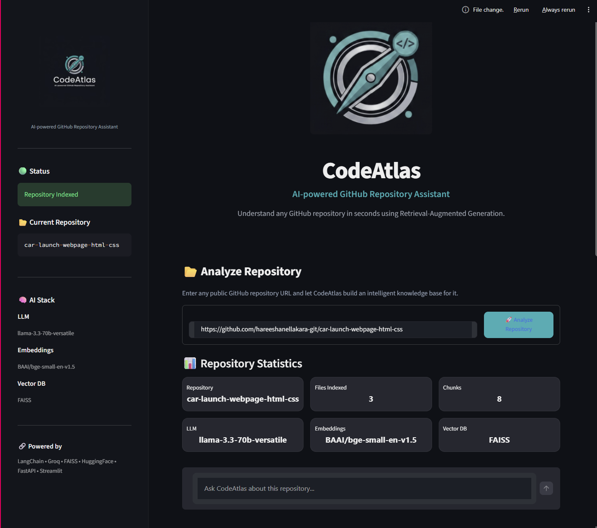
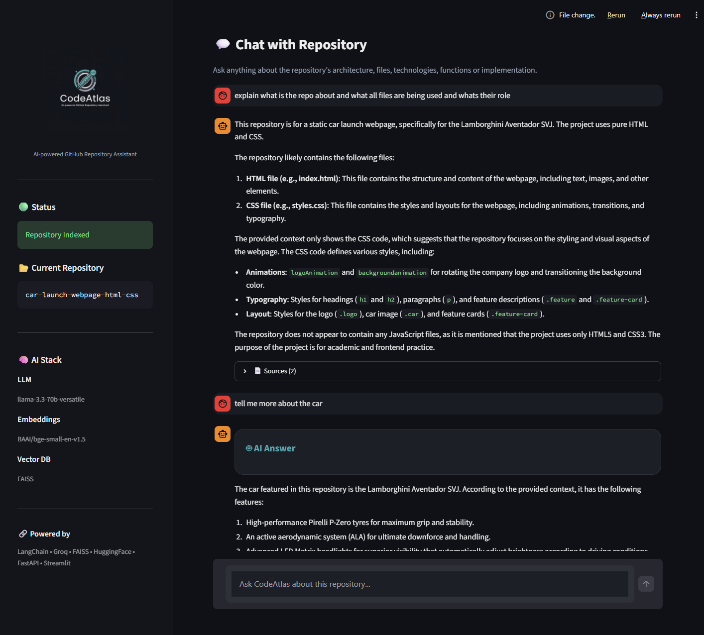
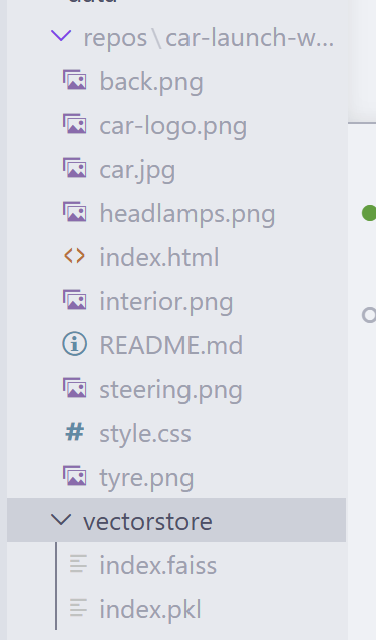

# 🤖 CodeAtlas

> **AI-powered GitHub Repository Assistant built with LangChain, FastAPI, Streamlit, HuggingFace Embeddings, FAISS, and Groq.**


## 🌐 Live Demo

🚀 **Try CodeAtlas Live**

**Frontend:** https://your-streamlit-url.streamlit.app

**Backend API:** https://your-backend-url.onrender.com

---


CodeAtlas is an AI-powered GitHub Repository Assistant that helps developers understand unfamiliar codebases through natural language conversations. It automatically clones a public repository, builds a semantic knowledge base using **Retrieval-Augmented Generation (RAG)**, and answers questions with context-aware responses backed by the repository's source code.


---

## ⭐ Highlights

- 🤖 AI-powered GitHub Repository Assistant
- 🔍 Retrieval-Augmented Generation (RAG)
- ⚡ FastAPI + Streamlit architecture
- 🧠 LangChain + Groq + HuggingFace Embeddings + FAISS
- 🏗️ Modular architecture following Separation of Concerns
- 📚 Automatic repository indexing and semantic code search

---


## 📸 Screenshots


### Home Page



### Repository Analysis & AI Response



### Natural Language Code Query



### Automatic Repository Cloning & Vector Index Creation




---

# ✨ Features

* 🔗 Analyze any public GitHub repository
* 🤖 Ask questions about the codebase in natural language
* 📚 Retrieval-Augmented Generation (RAG) pipeline
* 🧠 Semantic code search using HuggingFace embeddings
* 🗄️ FAISS vector database for efficient retrieval
* ⚡ Fast inference using Groq Llama 3.3
* 📄 Displays source files used to generate every answer
* 📊 Repository statistics after indexing
* 💬 Interactive ChatGPT-style interface
* 🎨 Modern responsive Streamlit UI
* 🔄 Automatic repository cloning and indexing

---

# 🚀 Motivation

Developers often spend significant time understanding unfamiliar repositories before contributing to them.

Traditional approaches involve:

* Reading README files
* Searching through folders
* Opening multiple files
* Understanding project structure manually

CodeAtlas automates this process using Retrieval-Augmented Generation.

Users simply provide a repository URL and ask questions like:

* What does this project do?
* Explain the architecture.
* Which files implement authentication?
* How is routing handled?
* Which technologies are used?

The assistant retrieves the most relevant code snippets before generating an answer, ensuring responses remain grounded in the repository instead of relying solely on the language model.

---

# 🏗️ System Architecture

```text
                        User

                          │

                          ▼

                 Streamlit Frontend

                          │

                          ▼

                 FastAPI Backend

          ┌───────────────┴───────────────┐

          ▼                               ▼

 Repository Ingestion              Chat Endpoint

          │                               │

          ▼                               ▼

     Clone Repository             Retrieval Chain

          │                               │

          ▼                               ▼

    Load Source Files             FAISS Retriever

          │                               │

          ▼                               ▼

      Text Splitter               Relevant Chunks

          │                               │

          ▼                               ▼

 HuggingFace Embeddings      Prompt + Llama 3.3

          │                               │

          ▼                               ▼

      FAISS Index                 Final Response

                          │

                          ▼

                    Streamlit UI
```

---

# ⚙️ Technology Stack

| Category             | Technologies                           |
| -------------------- | -------------------------------------- |
| Frontend             | Streamlit                              |
| Backend              | FastAPI                                |
| LLM                  | Groq (Llama 3.3-70B Versatile)         |
| Framework            | LangChain                              |
| Embeddings           | sentence-transformers/all-MiniLM-L6-v2 |
| Vector Database      | FAISS                                  |
| Repository Access    | GitPython                              |
| Programming Language | Python                                 |

---

## 🏛️ Software Engineering Principles

CodeAtlas was designed using modern software engineering practices to ensure the application remains modular, maintainable, and scalable.

### Separation of Concerns (SoC)

The project follows the **Separation of Concerns** principle by dividing responsibilities across independent modules.

* **Frontend Layer** – Streamlit interface responsible only for user interaction and visualization.
* **API Layer** – FastAPI endpoints handle HTTP requests and coordinate application flow.
* **Business Logic Layer** – Repository ingestion, chat orchestration, and indexing services.
* **AI Layer** – LangChain retrieval pipeline, prompt engineering, embeddings, and LLM interaction.
* **Data Layer** – GitHub repositories, document loading, chunking, and FAISS vector storage.

This layered architecture makes each component independent, easier to test, and simpler to extend without affecting the rest of the application.

### Modular Architecture

Instead of placing all logic inside a single file, the application is organized into dedicated modules for:

* Repository ingestion
* Document loading
* Chunking
* Vector database management
* Retrieval pipeline
* API communication
* Session management
* Frontend components

This improves readability, maintainability, and future scalability while closely reflecting real-world software engineering practices.


# 🧠 How CodeAtlas Works

## Step 1 — Repository Ingestion

The user provides a GitHub repository URL.

Example:

```text
https://github.com/username/project
```

The backend clones the repository locally.

---

## Step 2 — Document Loading

The repository is scanned recursively.

Supported source files include:

* Python
* Java
* C/C++
* JavaScript
* TypeScript
* HTML
* CSS
* JSON
* YAML
* Markdown
* Text files

Each file becomes a LangChain Document with metadata such as its file path.

---

## Step 3 — Text Chunking

Large files are divided into smaller chunks using LangChain's Recursive Character Text Splitter.

Chunking improves retrieval quality by allowing the system to retrieve only the relevant portions of the repository.

---

## Step 4 — Embedding Generation

Each chunk is converted into a dense vector representation using:

```
sentence-transformers/all-MiniLM-L6-v2
```

Embeddings capture semantic meaning rather than exact keyword matches.

---

## Step 5 — Vector Storage

All embeddings are stored inside a FAISS vector database.

FAISS enables extremely fast similarity search over thousands of code chunks.

---

## Step 6 — Retrieval-Augmented Generation (RAG)

When a user asks a question:

1. The question is embedded.
2. FAISS retrieves the most relevant code chunks.
3. Retrieved context is injected into the prompt.
4. Groq's Llama 3.3 generates the final answer.

This significantly reduces hallucinations by grounding responses in the repository.

---

# 📂 Project Structure

```text
CodeAtlas/

├── backend/
│   ├── api/
│   ├── loaders/
│   ├── services/
│   ├── config.py
│   └── main.py
│
├── frontend/
│   ├── components/
│   ├── styles/
│   ├── assets/
│   ├── session_state.py
│   ├── api_client.py
│   └── app.py
│
├── data/
│   ├── repos/
│   └── vectorstore/
│
├── requirements.txt
├── README.md
└── .env
```

---

# ▶️ Installation

Clone the repository.

```bash
git clone <repository-url>
cd CodeAtlas
```

Create a virtual environment.

```bash
python -m venv venv
```

Activate it.

Windows

```bash
venv\Scripts\activate
```

Linux/macOS

```bash
source venv/bin/activate
```

Install dependencies.

```bash
pip install -r requirements.txt
```

Create a `.env` file.

```env
GROQ_API_KEY=YOUR_GROQ_API_KEY
```

---

# ▶️ Running the Application

Start the FastAPI backend.

```bash
uvicorn backend.main:app --reload
```

Open another terminal and start the frontend.

```bash
streamlit run frontend/app.py
```

---

# 💬 Example Questions

* What is this repository about?
* Explain the project architecture.
* Which technologies are used?
* What does the README contain?
* Which files define the UI?
* Explain the CSS structure.
* Where is authentication implemented?
* How is routing handled?
* Describe the project folder structure.
* Summarize this repository for a beginner.

---

# 🎯 Key Learning Outcomes

This project demonstrates practical understanding of:

* Retrieval-Augmented Generation (RAG)
* Semantic Search
* Vector Databases
* Prompt Engineering
* LangChain Pipelines
* FastAPI Development
* Streamlit UI Development
* REST API Integration
* Repository Parsing
* Software Architecture
* Modular Backend Design

---

# 🔮 Future Improvements

* Multi-repository support
* Persistent conversation memory
* GitHub Issues integration
* Branch selection
* Commit history analysis
* Pull Request summarization
* Function-level code explanations
* Line-number citations
* Docker support
* Cloud deployment
* Authentication
* Repository caching
* Support for private repositories using GitHub tokens

---

# 👨‍💻 Author

**Hareesha Nellakara**

Developed as an end-to-end AI application to explore modern Retrieval-Augmented Generation (RAG), software architecture, and developer productivity tools.

---

# 📄 License

This project is intended for educational and portfolio purposes.
